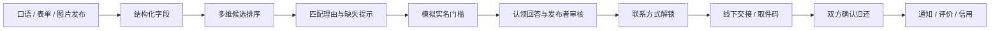
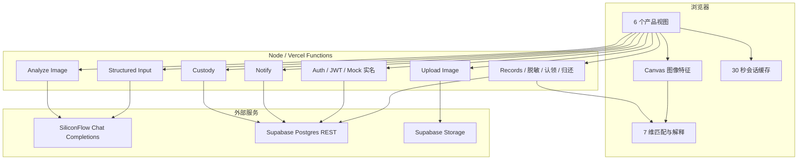
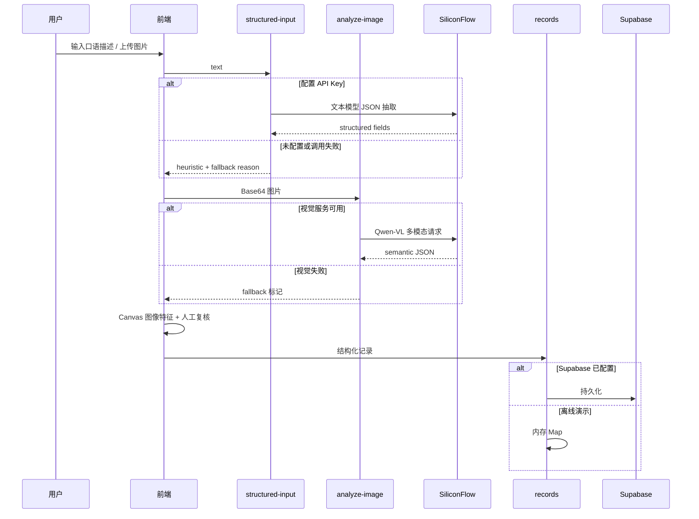
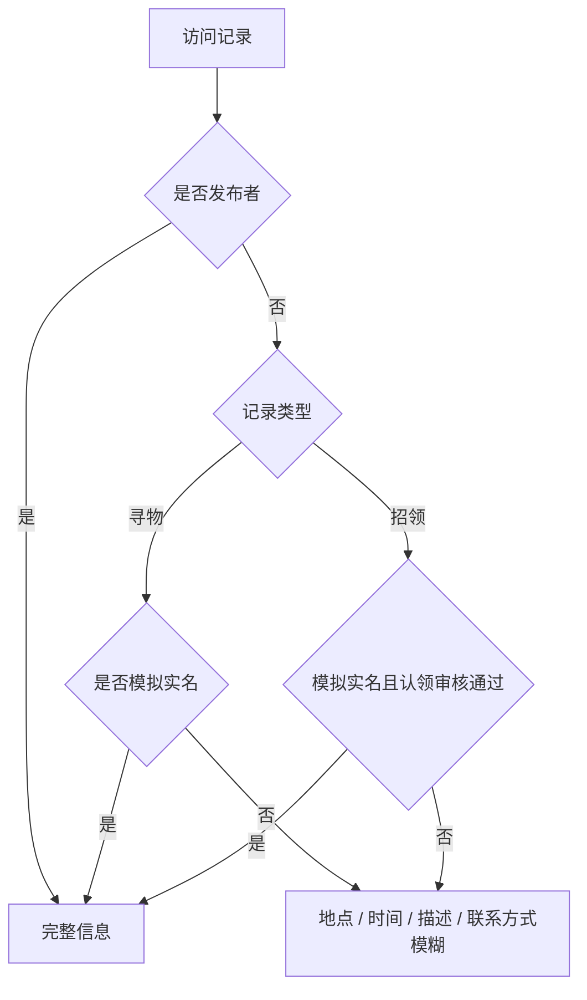
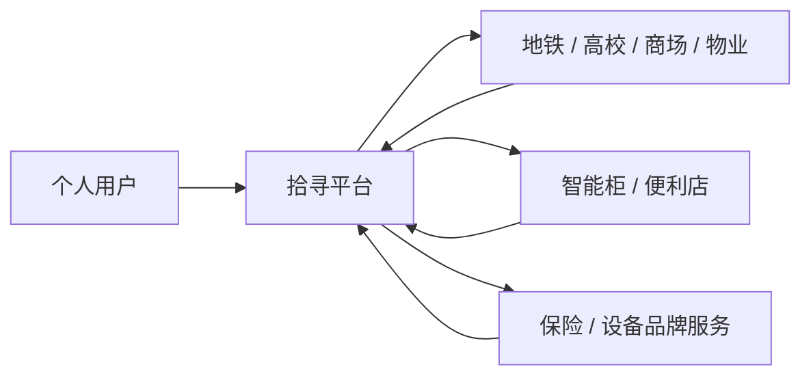

# 04｜产品架构与数据流程

## 一、产品闭环

主线不是“做一个识图页面”，而是用 AI 降低发布成本、补充匹配证据，再用权限、审核和双边确认完成业务闭环。

## 二、系统架构

## 三、运行模式

### 离线演示模式（默认）

- 无 Supabase：`records` 返回内存种子数据，发布写入进程内 Map。
- 无 SiliconFlow Key：文本走启发式提取，图片只用本地特征。
- 登录 / 实名：Mock。
- 认领、评价、举报：部分接口返回 fallback 成功，用于流程演示，不保证服务重启后保留。

### 外部服务模式

- Supabase：记录、用户、通知、认领、评价、举报、归还确认持久化。
- Storage：图片上传并返回 URL。
- SiliconFlow：文本模型与视觉模型真实调用。
- 仍为 Mock：微信 OAuth、权威实名、机构接入、系统 Push。

## 四、发布数据流

## 五、匹配数据流

1. 只比较寻物与招领的异类记录。
2. 检查 7 个维度的可用性。
3. 对可用维度计算分数；缺失维度为 `null`。
4. 可用权重归一化，得到 Weighted Score。
5. 用证据覆盖系数保守降分。
6. 生成正向理由、缺失提示和人工核验提醒。
7. 排序返回 Top-5；页面不把排序分称为准确率。

## 六、权限与隐私

服务端脱敏：

- 地点：保留到道路附近或区县范围。
- 时间：转换为上午 / 下午 / 晚上或相对日期。
- 描述：只保留前 30 字。
- 联系方式：替换为特殊占位符。
- 取件码：仅记录发布者可见；取件接口校验发布者或认领者。

注意：当前“实名”是 Mock；Storage URL 为公开 URL。生产版需要权威认证、私有图片、签名 URL、访问审计和数据保留策略。

## 七、数据模型

| 表 | 作用 |
|---|---|
| `lost_found_records` | 失物 / 招领主体、图片、语义、状态、认领关系 |
| `shiyun_users` | 演示账号、实名状态、角色、信用与等级 |
| `shiyun_claim_requests` | 认领回答与审核状态 |
| `shiyun_resolved_records` | 拾到者 / 失主双边确认与积分幂等 |
| `shiyun_notifications` | 站内消息与已读状态 |
| `shiyun_custody_points` | 代保管点 |
| `shiyun_reviews` | 完成后的评价 |
| `shiyun_reports` | 举报与处理状态 |
| `shiyun_credit_logs` | 信用变更日志 |

## 八、部署与安全边界

- 浏览器不直接持有 Supabase Service Role Key 或 SiliconFlow Key。
- Vercel Functions 读取环境变量并调用外部服务。
- Supabase RLS 默认不向 anon/authenticated 开放，后端用 Service Role。
- 破坏性 `migrate-city` 未暴露为部署路由。
- `diag`、`sync-status`、`sync-seeds` 要求管理员 JWT。
- 生产环境必须配置 `LOST_FOUND_JWT_SECRET`；本地缺失时临时密钥只保证演示可用。

## 九、可扩展商业化架构（方案）

可验证的商业假设：

- B2B SaaS：机构工作台、跨点位库存、工单与 SLA。
- 按件服务：代保管 / 取件核销服务费。
- API：向园区、校园或物业输出失物匹配能力。

这些均为后续方案，没有真实客户、合同或收入数据。