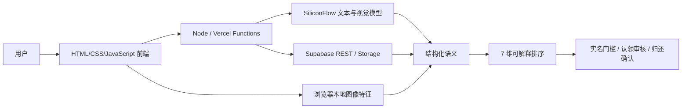

# 拾寻｜AI 失物协同闭环

> 面向 AI 产品经理 / AI 商业化产品经理求职展示的第二主项目。通过“低门槛发布—多模态识别—可解释匹配—隐私解锁—认领归还—通知复盘”串起城市失物协同闭环。

## 先说结论

这是一个可本地运行的产品原型，不是已规模化运营的平台。代码真实包含前端、Node/Vercel Functions、Supabase REST/Storage 接入、SiliconFlow 模型调用、图像本地特征、7 维匹配、通知与认领流程；默认不带任何真实密钥，离线运行时使用内存示例数据、Mock 登录/实名和启发式提取。

- 已实现：6 个前端视图、发布/匹配/通知/认领/归还主流程、隐私模糊、离线示例数据、异常降级。
- 真实 API 代码：SiliconFlow Chat Completions、Supabase REST 与 Storage；只有配置自己的环境变量后才会实际发出调用。
- Mock：微信登录、实名认证、无 Supabase 时的认领/评价/举报持久化、示例机构与代保管点。
- 未宣称：真实用户数、找回率、匹配准确率、商业收入或机构合作结果。

## 产品主线

1. 用户用自然语言或表单发布寻物 / 招领信息。
2. 文本模型抽取类型、类别、颜色、地点、时间、保管状态等字段；失败时回退本地规则并要求人工复核。
3. 上传图片后，浏览器提取颜色直方图、感知哈希、主色与色板；配置 SiliconFlow 后由 Qwen-VL 识别物品、颜色、品牌、可见文字和区分特征。
4. 匹配引擎融合类别、颜色、地点、时间、文本、图像、语义 7 维证据，缺失字段动态重分配权重并下调置信度。
5. 寻物帖在模拟实名后可联系；招领帖需模拟实名、提交验证答案并经发布者审核后解锁完整信息。
6. 消息中心轮询认领、审核、归还和信用变化；双方确认后闭环。

## 能力边界

| 模块 | 当前状态 | 求职展示时的准确说法 |
|---|---|---|
| 自然语言结构化 | 真实模型调用 + 本地启发式兜底 | “接入 SiliconFlow 文本模型，失败时规则降级并提示复核” |
| 图片语义识别 | 真实模型调用代码 | “接入 Qwen/Qwen3-VL-8B-Instruct；无 Key 时不伪造 AI 结果” |
| 本地图像特征 | 已实现 | “在浏览器提取直方图、感知哈希、主色与色板” |
| 多维匹配 | 已实现的规则加权排序 | “可解释排序原型，尚未用真实标注集完成校准” |
| Supabase | 真实 REST/Storage 代码 | “可持久化；交付包默认未配置，验证以离线模式为主” |
| 微信 / 实名 | Mock | “只演示流程和权限状态，不是微信或实名服务商接入” |
| 机构 / 商业合作 | 产品方案 + 示例数据 | “验证 B2B2C 路由假设，尚无真实合作或收入” |

## 快速运行

环境要求：Node.js 18+。

```bash
npm start
```

打开 `http://localhost:4173`。默认模式无需安装依赖、无需数据库、无需 API Key：服务会载入内存示例数据；自然语言提取走启发式规则；图片仍可完成本地特征提取。

运行交付检查：

```bash
npm run check
```

## 接入真实服务

参考 [.env.example](./.env.example) 将变量配置到当前 shell、Vercel 或 Render 的环境变量面板。项目不会自动读取 `.env` 文件，也不应把真实值写入仓库。

必需变量：

- `LOST_FOUND_SUPABASE_URL`
- `LOST_FOUND_SUPABASE_SERVICE_ROLE_KEY`（仅服务端使用）
- `LOST_FOUND_SILICON_FLOW_API_KEY`
- `LOST_FOUND_JWT_SECRET`（生产环境必须配置）

数据库初始化：在 Supabase SQL Editor 执行 [supabase-schema.sql](./supabase-schema.sql)。Storage 需要创建 `lost-found-images` bucket；当前代码返回公开 URL，生产化前应改成私有 bucket + 短时签名 URL。

## 匹配方法

基础权重为：类别 13%、颜色 8%、地点 14%、时间 11%、文本 14%、图像 20%、语义 20%。缺失维度不再给默认分，而是从分母剔除；最终排序分乘以证据覆盖系数，避免“只有类别一致”也出现虚高分。页面同步展示：

- 每个维度得分或“缺失”；
- 证据覆盖率；
- 最多 3 条正向证据；
- 缺失字段与人工核验提示。

该分数用于候选排序，不是模型置信度，也不是已验证的匹配准确率。评测设计见 [03_Evaluation与运营指标.md](./03_Evaluation与运营指标.md)。

## 架构



更完整的数据流程见 [04_产品架构与数据流程.md](./04_产品架构与数据流程.md)。

## 最适合面试展开的三点

1. 把 AI 放在“降低发布成本 + 提供可比较语义”位置，而不是用一句“AI 匹配”覆盖全部逻辑。
2. 用字段缺失感知、动态权重、证据覆盖和匹配理由，把黑盒分数变成可运营、可评测的产品机制。
3. 把隐私、认领审核、双边归还确认和通知串成闭环，并明确 Mock、真实接口和商业化方案边界。

## 项目文件

- `01_项目资产与完成度盘点.md`：代码证据与完成度边界
- `02_AI调用与匹配逻辑说明.md`：模型、算法、异常兜底
- `03_Evaluation与运营指标.md`：离线评测与漏斗指标
- `04_产品架构与数据流程.md`：系统、数据、权限流
- `05_简历项目描述.md`：两套岗位版本
- `06_面试讲述与高频追问.md`：3 分钟讲述与追问
- `07_展示截图清单.md`：作品集截图脚本
- `08_运行验证记录.md`：离线接口、页面与敏感信息检查结果
- `CHANGELOG.md`：本次优化记录

## 安全说明

交付包不含真实 API Key。Vercel 不再暴露破坏性迁移接口；诊断与种子同步接口限制为管理员；JWT 无显式密钥时使用进程级随机密钥；Supabase schema 默认拒绝匿名直连。仍需关注公开图片 URL、Mock 实名、内存限流与缺少生产级审计日志等风险。# 第二轮验收补充（2026-07-12）

本轮已完成字段级抽取修正、首页三态、真实 API 驱动统计、12 条回归、24 项 Smoke Test、双模式兼容检查和 7 张真实运行截图。证据入口见 `docs/verification/`。

运行顺序：

```bash
npm install
npm run check
npm run test:heuristic
npm run test:smoke
npm start
```

默认无 Key/数据库时进入离线演示；配置合法服务端变量后优先真实 SiliconFlow 与 Supabase。在线模式本轮仅检查代码路径，未调用生产服务。

安全边界：本副本不是 Git 仓库，也未绑定 Vercel Project；不要从该目录执行部署。后续应选择性合并到 Trae 新分支并先创建 Preview。

## 合并前微修（2026-07-13）

- 删除未被业务或测试引用的 vercel、fontkit、linebreak、pptxgenjs、prismjs、skia-canvas；项目运行与测试只依赖 Node.js 内置模块。
- 重新生成最小 package-lock.json，实际 npm install 未下载原生依赖，也未创建 node_modules。
- 在原 12 条基础上新增 9 条非模板表达回归，覆盖句首地点、动作边界、黑伞/蓝杯子、模糊时刻、上周五和无冒号微信号；21/21 通过。
- 启发式仍仅是无 Key 兜底，不代表模型准确率或真实线上效果。
- 页面与 7 张截图资产未修改；真实 SiliconFlow/Supabase 接入未删除或替换。
